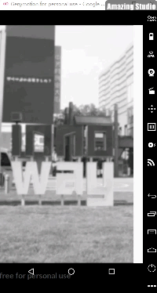

## 今日快讯

主要记录练手demo的相关知识点及提交过程。

#### 1、视频全屏播放，VideoView全屏显示bug解决

<div align=center></div>

VideoView的全屏问题：VideoView会根据视频文件的大小来改变自身的大小，所以要通过自定义的方式解决。

我们看VideoView的onMeasure方法

```java
@Override
    protected void onMeasure(int widthMeasureSpec, int heightMeasureSpec) {

        int width = getDefaultSize(mVideoWidth, widthMeasureSpec);
        int height = getDefaultSize(mVideoHeight, heightMeasureSpec);
		...
            if (widthSpecMode == MeasureSpec.EXACTLY && heightSpecMode == MeasureSpec.EXACTLY) {
                // the size is fixed
                width = widthSpecSize;
                height = heightSpecSize;

                // for compatibility, we adjust size based on aspect ratio
                // 为了兼容性，对测量的宽高做了一定的调整，这里就是导致全屏异常的根本原因
                if ( mVideoWidth * height  < width * mVideoHeight ) {
                    //Log.i("@@@", "image too wide, correcting");
                    width = height * mVideoWidth / mVideoHeight;
                } else if ( mVideoWidth * height  > width * mVideoHeight ) {
                    //Log.i("@@@", "image too tall, correcting");
                    height = width * mVideoHeight / mVideoWidth;
                }
            ...
        setMeasuredDimension(width, height);
    }
```

我们可以看到，为了兼容性，对测量的宽、高按一定比例进行了调整，这就是全屏异常的根本原因，我们可以重写onMeasure方法，直接设定测量的宽和高, 就可解决这个问题。

```java
public class FullScreenVideoView extends VideoView {
    ...
    @Override
    protected void onMeasure(int widthMeasureSpec, int heightMeasureSpec) {
        // widthMeasureSpec 包含两个主要的内容 1、测量模式 2、测量大小
        int width = getDefaultSize(0, widthMeasureSpec);
        int height = getDefaultSize(0, heightMeasureSpec);
        setMeasuredDimension(width, height);
//        super.onMeasure(widthMeasureSpec, heightMeasureSpec);
    }
    ... 
}

```

xml里面的控件属性，避免重复编写代码，可以采取将相同属性的代码抽取为样式，进行复用。具体做法为，在属性处右键Refacter--->Extract--->Style

------

自定义注解的牛刀小试，看了Butterknife的注解BindView，尝试通过自定义注解的方式，添加setContentView(@LayoutRes int layoutResID) 中的参数

```java
@Retention(RUNTIME) @Target(FIELD)
public @interface BindView {
  /** View ID to which the field will be bound. */
  @IdRes int value();
}

```

先创建一个基类BaseActivity，抽取相同部分功能，子类继承。

```java
public class BaseActivity extends AppCompatActivity {

    @Override
    protected void onCreate(@Nullable Bundle savedInstanceState) {
        super.onCreate(savedInstanceState);
        ViewInject annotation = this.getClass().getAnnotation(ViewInject.class);
        if (annotation != null) {
            int layoutId = annotation.layoutId();
            if (layoutId > 0) {
                setContentView(layoutId);
                ButterKnife.bind(this);
            } else {
                throw new RuntimeException(" layoutId < 0 ");
            }
        } else {
            throw new NullPointerException(" annotation is null ");
        }

    }
}

```

自定义注解

```java
@Retention(RUNTIME)// 运行时起作用
@Target(TYPE) // 类、接口注解
public @interface ViewInject {
    int layoutId() default -1;
}
```

需要继承基类BaseActivity的setContentView()方法，只需要添加注解即可实现。

```java
@ViewInject(layoutId = R.layout.activity_main)
public class MainActivity extends BaseActivity {

    @BindView(R.id.fl_main_bottom)
    FrameLayout flMainBottom;

    @Override
    protected void onCreate(Bundle savedInstanceState) {
        super.onCreate(savedInstanceState);
    }
}
```


mvp改造：中介者设计模式

4个角色

第一个角色：抽象中介者->MvpPresenter(定义接口)

第二个角色：具体中介者->具体功能模块(例如：LoginPresenter等)

第三个角色：抽象同事

- M层：MvpModel
- V层：MvpView

第四个角色：具体同事

- M层：例如->LoginModel...
- V层：例如->MainActivity...

